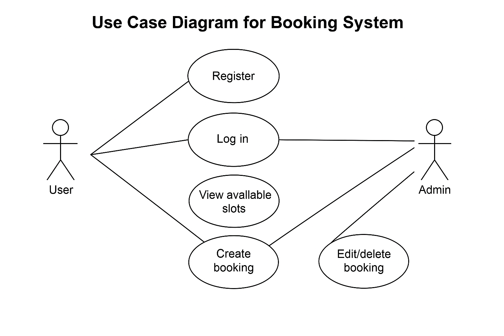

# Requirement Analysis in Software Development

This repository covers the key concepts, practices, and examples related to **Requirement Analysis** in the Software Development Life Cycle (SDLC). It is intended to help learners and professionals understand the significance of analyzing software requirements before development begins.

---

## What is Requirement Analysis?

**Requirement Analysis** is the process of identifying, gathering, analyzing, and documenting the needs and requirements of stakeholders for a software system. It ensures that all project requirements are clearly defined and agreed upon before development starts. This phase is critical because it lays the foundation for the design, development, and testing of the system. A clear and complete set of requirements reduces the chances of project failure, scope creep, and costly rework.

---

## Why is Requirement Analysis Important?

- **Reduces Development Errors:** Well-defined requirements minimize misunderstandings and mistakes during development.
- **Improves Communication:** It helps bridge the gap between stakeholders (clients, users) and developers, ensuring everyone is on the same page.
- **Guides Project Scope & Planning:** Requirement analysis helps in estimating time, cost, and effort accurately, enabling better project management.

---

## Key Activities in Requirement Analysis

- **Requirement Gathering:** Collecting information from stakeholders about what they expect from the system.
- **Requirement Elicitation:** Using techniques like interviews, surveys, and observations to draw out detailed requirements.
- **Requirement Documentation:** Recording the requirements clearly and systematically for reference throughout the project.
- **Requirement Analysis and Modeling:** Breaking down and analyzing the gathered data and representing it through models or diagrams.
- **Requirement Validation:** Ensuring all documented requirements are correct, complete, and agreed upon by stakeholders.

---

## Types of Requirements

### Functional Requirements

These are features and functionalities the system must perform.

**Examples (Booking Management System):**
- Users can register and log in.
- Admins can create, edit, and delete bookings.
- Users can view available booking slots.

### Non-functional Requirements

These define system performance, usability, reliability, etc.

**Examples:**
- The system should respond to user actions within 2 seconds.
- The application must be accessible 99.9% of the time.
- All user data must be encrypted and comply with GDPR.

---

## Use Case Diagrams

**Use Case Diagrams** visually represent the interactions between users (actors) and the system. They help in understanding the system scope and user roles early in the development process.

**Benefits:**
- Clarifies functional requirements
- Helps stakeholders visualize system behavior
- Facilitates better planning and design

---

## Acceptance Criteria

**Acceptance Criteria** are predefined conditions that a software product must meet to be accepted by stakeholders. They ensure that the delivered features work as expected and meet business needs.

**Example (Checkout Feature):**
- The user must be logged in to proceed to checkout.
- The checkout process must include a summary of the booking, total cost, and payment confirmation.
- An email receipt should be sent automatically after successful checkout.

---
